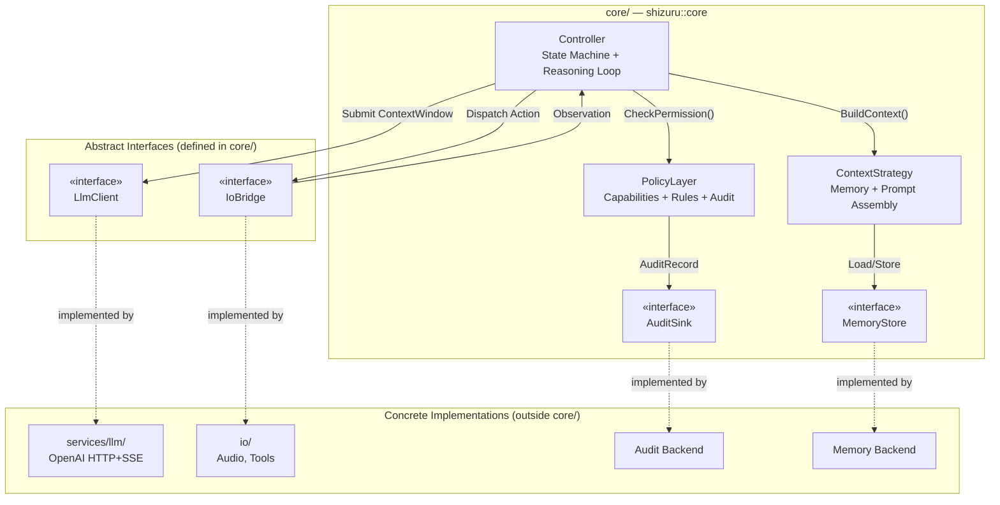
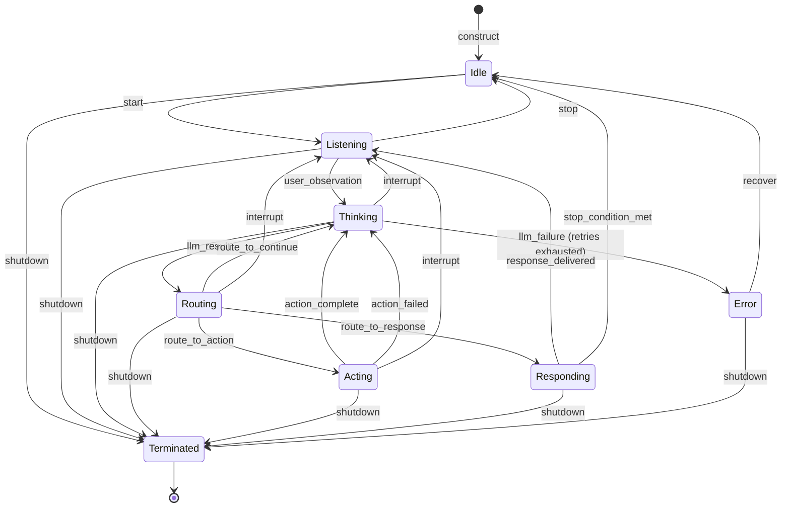

# Design Document: Agent Core Module

## Overview

The Agent Core module (`core/`) implements the brain of the Shizuru voice conversation agent. It provides three foundational subsystems under the `shizuru::core` namespace:

1. **Controller** — A finite state machine that drives the agent's reasoning loop (observe → think → route → act → respond), manages session lifecycle, handles retries/errors, enforces budget guardrails, and supports mid-turn interruption.
2. **Context Strategy** — Assembles LLM prompts from system instructions, conversation memory, and current observations. Manages token budgets, memory summarization, and external context injection.
3. **Policy Layer** — Enforces capability-based permissions on actions, evaluates declarative policy rules, and produces audit records for all decisions.

The Core module is platform-independent C++17. It depends on external services (LLM, IO, storage) exclusively through abstract interfaces injected at construction time. This makes the module fully testable with mock implementations and decoupled from any concrete backend.

### Key Design Decision: External Service Clients as Utilities

Per project direction, the LLM client is NOT a standalone top-level module. It is one of many external service clients (alongside future TTS, ASR, etc.) that the core treats uniformly through abstract interfaces. The `core/` module defines the abstract `ServiceClient` pattern; concrete implementations live under a shared `services/` utility directory (replacing the current `llm/` top-level directory). The same abstract interface pattern used for `LlmClient` will generalize to `TtsClient`, `AsrClient`, and other service integrations.

## Architecture

### High-Level Component Interaction



### Controller State Machine



### Transition Table

| Current State | Event                  | Next State   |
|---------------|------------------------|--------------|
| Idle          | `start`                | Listening    |
| Idle          | `shutdown`             | Terminated   |
| Listening     | `user_observation`     | Thinking     |
| Listening     | `shutdown`             | Terminated   |
| Listening     | `stop`                 | Idle         |
| Thinking      | `llm_result`           | Routing      |
| Thinking      | `llm_failure`          | Error        |
| Thinking      | `interrupt`            | Listening    |
| Thinking      | `shutdown`             | Terminated   |
| Routing       | `route_to_action`      | Acting       |
| Routing       | `route_to_response`    | Responding   |
| Routing       | `route_to_continue`    | Thinking     |
| Routing       | `interrupt`            | Listening    |
| Routing       | `shutdown`             | Terminated   |
| Acting        | `action_complete`      | Thinking     |
| Acting        | `action_failed`        | Thinking     |
| Acting        | `interrupt`            | Listening    |
| Acting        | `shutdown`             | Terminated   |
| Responding    | `response_delivered`   | Listening    |
| Responding    | `stop_condition_met`   | Idle         |
| Responding    | `shutdown`             | Terminated   |
| Error         | `recover`              | Idle         |
| Error         | `shutdown`             | Terminated   |

### Threading Model

```
┌──────────────────────────────────────────────────┐
│  IO Threads (audio callbacks, network, UI)       │
│  ─ Call Controller::EnqueueObservation()          │
│  ─ Call PolicyLayer::GrantCapability()            │
│  ─ Thread-safe via mutex-protected queues         │
└──────────────┬───────────────────────────────────┘
               │ observation queue (mutex + condvar)
┌──────────────▼───────────────────────────────────┐
│  Reasoning Loop Thread (owned by Controller)     │
│  ─ Dequeues observations                         │
│  ─ Drives state transitions                      │
│  ─ Calls ContextStrategy, LlmClient, PolicyLayer │
│  ─ All state mutation happens here               │
└──────────────────────────────────────────────────┘
```

The Controller owns a single reasoning loop thread. External threads enqueue observations into a thread-safe queue (std::mutex + std::condition_variable). All state transitions and subsystem calls happen on the reasoning loop thread, eliminating most internal locking needs. The observation queue and the state accessor are the only cross-thread synchronization points.

ContextStrategy and PolicyLayer are called only from the reasoning loop thread during normal operation. Capability grant/revoke on PolicyLayer uses a separate mutex to allow runtime changes from external threads.


## Components and Interfaces

### Directory Structure

Following the same flat module layout as `io/audio/` — headers and sources coexist in subdirectories, no `include/` or `src/` separation. CMake sets `target_include_directories` to `${CMAKE_CURRENT_SOURCE_DIR}`, so includes look like `#include "controller/controller.h"`.

```
core/
├── CMakeLists.txt
├── controller/
│   ├── controller.h                # Controller class
│   ├── controller.cpp
│   ├── types.h                     # State, Event enums + Observation, ActionCandidate structs
│   └── config.h                    # ControllerConfig
├── context/
│   ├── context_strategy.h          # ContextStrategy class
│   ├── context_strategy.cpp
│   ├── types.h                     # ContextWindow, ContextMessage, MemoryEntry structs
│   └── config.h                    # ContextConfig
├── policy/
│   ├── policy_layer.h              # PolicyLayer class
│   ├── policy_layer.cpp
│   ├── types.h                     # PolicyRule, PolicyResult, AuditRecord structs
│   └── config.h                    # PolicyConfig
├── interfaces/
│   ├── llm_client.h                # Abstract LlmClient interface
│   ├── io_bridge.h                 # Abstract IoBridge interface
│   ├── audit_sink.h                # Abstract AuditSink interface
│   └── memory_store.h              # Abstract MemoryStore interface
└── session/
    ├── session.h                   # AgentSession aggregate / facade
    └── session.cpp
```

Note: The abstract interfaces defined in `core/interfaces/` are the contracts that external service clients must implement. For example, the LLM client implementation will live under `services/llm/` (not at the project root), and future TTS/ASR clients will follow the same pattern under `services/tts/`, `services/asr/`, etc. The `core/` module never includes concrete service headers.

### Abstract Interfaces

#### LlmClient (core/interfaces/llm_client.h)

```cpp
namespace shizuru::core {

// Callback for streaming tokens from the LLM.
using StreamCallback = std::function<void(const std::string& token)>;

// Result of an LLM inference call.
struct LlmResult {
  ActionCandidate candidate;
  int prompt_tokens = 0;
  int completion_tokens = 0;
};

// Abstract interface for LLM service clients.
// Concrete implementations (OpenAI, Anthropic, local, etc.) live outside core/.
class LlmClient {
 public:
  virtual ~LlmClient() = default;

  // Submit a context window and receive an action candidate.
  // Blocks until the full response is available.
  // Throws or returns error status on failure.
  virtual LlmResult Submit(const ContextWindow& context) = 0;

  // Submit with streaming callback for incremental token delivery.
  virtual LlmResult SubmitStreaming(const ContextWindow& context,
                                    StreamCallback on_token) = 0;

  // Request cancellation of an in-progress call.
  virtual void Cancel() = 0;
};

}  // namespace shizuru::core
```

#### IoBridge (core/interfaces/io_bridge.h)

```cpp
namespace shizuru::core {

// Result of an IO action execution.
struct ActionResult {
  bool success = false;
  std::string output;       // Serialized result data
  std::string error_message; // Non-empty on failure
};

// Abstract interface for dispatching IO actions and receiving observations.
class IoBridge {
 public:
  virtual ~IoBridge() = default;

  // Execute an IO action synchronously. Returns the result.
  virtual ActionResult Execute(const ActionCandidate& action) = 0;

  // Request cancellation of an in-progress action.
  virtual void Cancel() = 0;
};

}  // namespace shizuru::core
```

#### AuditSink (core/interfaces/audit_sink.h)

```cpp
namespace shizuru::core {

class AuditSink {
 public:
  virtual ~AuditSink() = default;

  // Write an audit record. Must be thread-safe.
  virtual void Write(const AuditRecord& record) = 0;

  // Flush any buffered records.
  virtual void Flush() = 0;
};

}  // namespace shizuru::core
```

#### MemoryStore (core/interfaces/memory_store.h)

```cpp
namespace shizuru::core {

class MemoryStore {
 public:
  virtual ~MemoryStore() = default;

  // Append a memory entry for the given session.
  virtual void Append(const std::string& session_id,
                      const MemoryEntry& entry) = 0;

  // Retrieve the N most recent entries for a session.
  virtual std::vector<MemoryEntry> GetRecent(const std::string& session_id,
                                              size_t count) = 0;

  // Retrieve all entries for a session.
  virtual std::vector<MemoryEntry> GetAll(const std::string& session_id) = 0;

  // Replace a range of entries with a summary entry (for summarization).
  virtual void Summarize(const std::string& session_id,
                         size_t start_index, size_t end_index,
                         const MemoryEntry& summary) = 0;

  // Remove all entries for a session.
  virtual void Clear(const std::string& session_id) = 0;
};

}  // namespace shizuru::core
```

### Core Classes

#### Controller

```cpp
namespace shizuru::core {

class Controller {
 public:
  // All dependencies injected via constructor.
  Controller(ControllerConfig config,
             std::unique_ptr<LlmClient> llm,
             std::unique_ptr<IoBridge> io,
             ContextStrategy& context,
             PolicyLayer& policy);

  ~Controller();

  // Thread-safe: enqueue an observation from any thread.
  void EnqueueObservation(Observation obs);

  // Start the reasoning loop on its own thread.
  void Start();

  // Request shutdown (thread-safe). Blocks until loop exits.
  void Shutdown();

  // Thread-safe state accessor.
  State GetState() const;

  // Register callbacks for state transitions.
  using TransitionCallback = std::function<void(State from, State to, Event event)>;
  void OnTransition(TransitionCallback cb);

  // Register callback for diagnostic events.
  using DiagnosticCallback = std::function<void(const std::string& message)>;
  void OnDiagnostic(DiagnosticCallback cb);

 private:
  void RunLoop();                          // Main reasoning loop
  bool TryTransition(Event event);         // Validate + execute transition
  void HandleThinking();                   // Build context, call LLM
  void HandleRouting(ActionCandidate ac);  // Route LLM output
  void HandleActing(ActionCandidate ac);   // Execute IO action
  void HandleResponding(ActionCandidate ac); // Deliver response
  bool CheckBudget();                      // Enforce guardrails
  void HandleInterrupt();                  // Cancel in-progress work

  // Static transition table
  static const std::unordered_map<std::pair<State, Event>, State,
                                   PairHash> kTransitionTable;

  ControllerConfig config_;
  std::unique_ptr<LlmClient> llm_;
  std::unique_ptr<IoBridge> io_;
  ContextStrategy& context_;
  PolicyLayer& policy_;

  // State (accessed from loop thread; read via atomic for external queries)
  std::atomic<State> state_{State::kIdle};

  // Observation queue (cross-thread)
  std::mutex queue_mutex_;
  std::condition_variable queue_cv_;
  std::deque<Observation> observation_queue_;

  // Session counters
  int turn_count_ = 0;
  int total_prompt_tokens_ = 0;
  int total_completion_tokens_ = 0;
  int action_count_ = 0;
  std::chrono::steady_clock::time_point session_start_;

  // Loop thread
  std::thread loop_thread_;
  std::atomic<bool> shutdown_requested_{false};

  // Callbacks
  std::vector<TransitionCallback> transition_callbacks_;
  std::vector<DiagnosticCallback> diagnostic_callbacks_;
};

}  // namespace shizuru::core
```

#### ContextStrategy

```cpp
namespace shizuru::core {

class ContextStrategy {
 public:
  ContextStrategy(ContextConfig config, MemoryStore& store);

  // Initialize session with system instruction.
  void InitSession(const std::string& session_id,
                   const std::string& system_instruction = "");

  // Build a context window for the current turn.
  ContextWindow BuildContext(const std::string& session_id,
                             const Observation& current_observation);

  // Record a completed turn into memory.
  void RecordTurn(const std::string& session_id, const MemoryEntry& entry);

  // Inject external context (retrieved docs, user profile, etc.)
  void InjectContext(const std::string& session_id, const MemoryEntry& entry);

  // Update system instruction mid-session.
  void SetSystemInstruction(const std::string& session_id,
                            const std::string& instruction);

  // Release all memory for a session.
  void ReleaseSession(const std::string& session_id);

 private:
  void MaybeSummarize(const std::string& session_id);
  int EstimateTokens(const std::vector<MemoryEntry>& entries) const;

  ContextConfig config_;
  MemoryStore& store_;

  // Per-session system instructions
  std::mutex instruction_mutex_;
  std::unordered_map<std::string, std::string> system_instructions_;
};

}  // namespace shizuru::core
```

#### PolicyLayer

```cpp
namespace shizuru::core {

class PolicyLayer {
 public:
  PolicyLayer(PolicyConfig config, AuditSink& sink);

  // Check if an action is permitted for the given session.
  PolicyResult CheckPermission(const std::string& session_id,
                               const ActionCandidate& action);

  // Grant a capability to a session (thread-safe).
  void GrantCapability(const std::string& session_id,
                       const std::string& capability);

  // Revoke a capability from a session (thread-safe).
  void RevokeCapability(const std::string& session_id,
                        const std::string& capability);

  // Check if a session has a specific capability.
  bool HasCapability(const std::string& session_id,
                     const std::string& capability) const;

  // Record a state transition audit event.
  void AuditTransition(const std::string& session_id,
                       State from, State to, Event event);

  // Record an action execution audit event.
  void AuditAction(const std::string& session_id,
                   const ActionCandidate& action,
                   PolicyResult result);

  // Resolve a pending approval.
  void ResolveApproval(const std::string& session_id,
                       uint64_t request_id, bool approved);

  // Initialize session with default capabilities.
  void InitSession(const std::string& session_id);

  // Release session data.
  void ReleaseSession(const std::string& session_id);

 private:
  PolicyResult EvaluateRules(const std::string& session_id,
                             const ActionCandidate& action);

  PolicyConfig config_;
  AuditSink& sink_;

  // Per-session capabilities (thread-safe access)
  mutable std::mutex cap_mutex_;
  std::unordered_map<std::string, std::unordered_set<std::string>> capabilities_;

  // Per-session audit sequence counters
  std::mutex seq_mutex_;
  std::unordered_map<std::string, uint64_t> sequence_numbers_;

  // Pending approvals
  std::mutex approval_mutex_;
  std::unordered_map<uint64_t, std::function<void(bool)>> pending_approvals_;
};

}  // namespace shizuru::core
```

#### AgentSession (Aggregate / Facade)

```cpp
namespace shizuru::core {

// Owns the lifecycle of a single agent session.
// Wires Controller, ContextStrategy, and PolicyLayer together.
class AgentSession {
 public:
  AgentSession(const std::string& session_id,
               ControllerConfig ctrl_config,
               ContextConfig ctx_config,
               PolicyConfig pol_config,
               std::unique_ptr<LlmClient> llm,
               std::unique_ptr<IoBridge> io,
               std::unique_ptr<MemoryStore> memory,
               std::unique_ptr<AuditSink> audit);

  ~AgentSession();

  void Start();
  void Shutdown();
  void EnqueueObservation(Observation obs);
  State GetState() const;

  const std::string& SessionId() const { return session_id_; }
  Controller& GetController() { return controller_; }
  ContextStrategy& GetContext() { return context_; }
  PolicyLayer& GetPolicy() { return policy_; }

 private:
  std::string session_id_;
  std::unique_ptr<MemoryStore> memory_;
  std::unique_ptr<AuditSink> audit_;
  ContextStrategy context_;
  PolicyLayer policy_;
  Controller controller_;
};

}  // namespace shizuru::core
```


## Data Models

Data types are split by subsystem: `core/controller/types.h`, `core/context/types.h`, and `core/policy/types.h`.

### Enums

```cpp
namespace shizuru::core {

enum class State {
  kIdle,
  kListening,
  kThinking,
  kRouting,
  kActing,
  kResponding,
  kError,
  kTerminated,
};

enum class Event {
  kStart,
  kStop,
  kShutdown,
  kUserObservation,
  kLlmResult,
  kLlmFailure,
  kRouteToAction,
  kRouteToResponse,
  kRouteToContinue,
  kActionComplete,
  kActionFailed,
  kResponseDelivered,
  kStopConditionMet,
  kInterrupt,
  kRecover,
};

enum class ActionType {
  kToolCall,
  kResponse,
  kContinue,
};

enum class PolicyOutcome {
  kAllow,
  kDeny,
  kRequireApproval,
};

enum class ObservationType {
  kUserMessage,
  kToolResult,
  kSystemEvent,
  kInterruption,
};

enum class MemoryEntryType {
  kUserMessage,
  kAssistantMessage,
  kToolCall,
  kToolResult,
  kSummary,
  kExternalContext,
};

}  // namespace shizuru::core
```

### Data Structures

```cpp
namespace shizuru::core {

// An input event from the external environment.
struct Observation {
  ObservationType type;
  std::string content;                    // Serialized payload
  std::string source;                     // Origin identifier (e.g., "user", "tool:web_search")
  std::chrono::steady_clock::time_point timestamp;
};

// An action proposed by the LLM.
struct ActionCandidate {
  ActionType type;
  std::string action_name;               // Tool name (for kToolCall)
  std::string arguments;                 // Serialized arguments (JSON string)
  std::string response_text;             // Response content (for kResponse)
  std::string required_capability;       // Capability needed to execute
};

// A single message in the context window sent to the LLM.
struct ContextMessage {
  std::string role;                      // "system", "user", "assistant", "tool"
  std::string content;
  std::string tool_call_id;             // For tool result messages
  std::string name;                     // Tool name (for tool messages)
};

// The assembled prompt for a single LLM inference call.
struct ContextWindow {
  std::vector<ContextMessage> messages;
  int estimated_tokens = 0;
};

// A stored piece of conversation memory.
struct MemoryEntry {
  MemoryEntryType type;
  std::string role;                      // "user", "assistant", "tool", "system"
  std::string content;
  std::string source_tag;               // For external context: origin identifier
  std::string tool_call_id;            // For tool call/result pairing
  std::chrono::steady_clock::time_point timestamp;
  int estimated_tokens = 0;
};

// A declarative policy rule.
struct PolicyRule {
  int priority = 0;                     // Lower number = higher priority
  std::string action_pattern;           // Glob or exact match on action_name
  std::string resource_pattern;         // Glob or exact match on target resource
  std::string required_capability;      // Capability that must be present
  PolicyOutcome outcome = PolicyOutcome::kDeny;
};

// Result of a policy evaluation.
struct PolicyResult {
  PolicyOutcome outcome;
  std::string reason;                   // Human-readable explanation
  uint64_t request_id = 0;             // Non-zero if RequireApproval (for async resolution)
};

// A structured audit log entry.
struct AuditRecord {
  uint64_t sequence_number = 0;
  std::string session_id;
  std::chrono::steady_clock::time_point timestamp;

  // State transition fields (optional)
  std::optional<State> previous_state;
  std::optional<State> new_state;
  std::optional<Event> triggering_event;

  // Action execution fields (optional)
  std::optional<std::string> action_type;
  std::optional<std::string> target_resource;
  std::optional<PolicyOutcome> policy_outcome;
  std::optional<std::string> denial_reason;
  std::optional<std::string> matching_rule;

  // Capabilities snapshot at time of evaluation
  std::vector<std::string> granted_capabilities;
};

}  // namespace shizuru::core
```

### Configuration Structs

```cpp
namespace shizuru::core {

struct ControllerConfig {
  int max_turns = 20;                              // Stop condition: max turns per session
  int max_retries = 3;                             // LLM retry limit
  std::chrono::milliseconds retry_base_delay{1000}; // Exponential backoff base
  std::chrono::seconds wall_clock_timeout{300};    // 5 min session timeout
  int token_budget = 100000;                       // Max cumulative tokens
  int action_count_limit = 50;                     // Max IO actions per session
};

struct ContextConfig {
  int max_context_tokens = 8000;                   // Token budget per context window
  int summarization_threshold = 50;                // Summarize when entries exceed this
  std::string default_system_instruction = "You are a helpful assistant.";
};

struct PolicyConfig {
  std::vector<PolicyRule> initial_rules;            // Rules loaded at session start
  std::unordered_set<std::string> default_capabilities; // Capabilities granted by default
};

}  // namespace shizuru::core
```

### External Service Client Pattern

The core module defines abstract interfaces that all external service clients implement. This pattern generalizes beyond LLM to any service the agent may need:

```
core/interfaces/
├── llm_client.h        # LLM inference (OpenAI, Anthropic, etc.)
├── io_bridge.h         # IO actions (tools, filesystem, APIs)
├── audit_sink.h        # Audit log backends
└── memory_store.h      # Memory persistence backends

services/                # Concrete implementations (outside core/)
├── llm/                 # OpenAI compatible HTTP+SSE client
│   ├── openai_client.h
│   └── openai_client.cpp
├── tts/                 # (future) Text-to-speech service client
├── asr/                 # (future) Speech recognition service client
└── ...
```

The `services/` directory replaces the current top-level `llm/` directory. Each service client implements the corresponding abstract interface from `core/interfaces/`. The runtime module (`runtime/`) is responsible for constructing concrete service clients and injecting them into `AgentSession`.


## Correctness Properties

*A property is a characteristic or behavior that should hold true across all valid executions of a system — essentially, a formal statement about what the system should do. Properties serve as the bridge between human-readable specifications and machine-verifiable correctness guarantees.*

### Property 1: Initial state is Idle

*For any* ControllerConfig and set of injected dependencies, a newly constructed Controller SHALL have its state equal to `State::kIdle`.

**Validates: Requirements 1.1**

### Property 2: Valid transitions produce correct next state

*For any* (current_state, event) pair that exists in the static transition table, calling `TryTransition(event)` on a Controller in `current_state` SHALL result in the Controller's state being equal to the next_state defined in the table.

**Validates: Requirements 1.2, 1.3, 1.5, 1.7, 1.8, 1.9, 2.3, 4.5, 12.3**

### Property 3: Invalid transitions preserve state

*For any* (current_state, event) pair that does NOT exist in the static transition table, calling `TryTransition(event)` SHALL leave the Controller's state unchanged and SHALL emit a diagnostic event.

**Validates: Requirements 1.10, 2.4**


### Property 4: Transition callbacks fire in order

*For any* valid state transition from state A to state B, the Controller SHALL invoke the on-exit callback for state A before invoking the on-enter callback for state B, and both SHALL be invoked exactly once.

**Validates: Requirements 2.5**

### Property 5: Action routing is determined by ActionType

*For any* ActionCandidate, when the Controller is in the `Routing` state: if `type == kToolCall`, the next state SHALL be `Acting`; if `type == kResponse`, the next state SHALL be `Responding`; if `type == kContinue`, the next state SHALL be `Thinking`.

**Validates: Requirements 1.6, 3.4, 3.5, 3.6**

### Property 6: Observation queue preserves FIFO order

*For any* sequence of Observations enqueued via `EnqueueObservation()`, the Controller SHALL dequeue and process them in the same order they were enqueued.

**Validates: Requirements 3.1**

### Property 7: Turn count stop condition

*For any* configured `max_turns` value N, the Controller SHALL terminate the reasoning loop and emit a timeout response after exactly N turns, transitioning to `Idle`.

**Validates: Requirements 3.7, 3.8, 1.8**


### Property 8: LLM retry with exponential backoff

*For any* configured `max_retries` value N and `retry_base_delay` D, when the LLM returns transient errors, the Controller SHALL retry up to N times with delays of D×2^k for the k-th retry (0-indexed), and SHALL transition to `Error` state if all retries are exhausted.

**Validates: Requirements 4.1, 4.2, 4.3**

### Property 9: IO action failure feeds back to Thinking

*For any* IO action that fails during the `Acting` state, the Controller SHALL record the failure as an Observation and transition to `Thinking` (not `Error`).

**Validates: Requirements 4.4**

### Property 10: Context window ordering invariant

*For any* set of MemoryEntries, system instruction, and current Observation, the assembled ContextWindow SHALL have messages ordered as: system message at index 0, then memory/history messages in chronological order, then the current Observation as the last message.

**Validates: Requirements 5.1, 5.2, 7.2**

### Property 11: Context window token budget with preservation

*For any* configured `max_context_tokens` budget and set of MemoryEntries, the assembled ContextWindow SHALL not exceed the token budget. If truncation is needed, older MemoryEntries SHALL be removed first, and the system message and current Observation SHALL never be truncated.

**Validates: Requirements 5.3, 5.4**


### Property 12: Tool call and result adjacency

*For any* tool call result Observation, the assembled ContextWindow SHALL contain the original tool call message and its result as adjacent messages (tool call immediately followed by tool result).

**Validates: Requirements 5.5**

### Property 13: Memory entry round-trip

*For any* completed Turn recorded via `RecordTurn()` or external context injected via `InjectContext()`, retrieving memory entries for that session SHALL return entries that contain the recorded content and correct source tags.

**Validates: Requirements 6.1, 6.5**

### Property 14: Memory summarization threshold

*For any* configured `summarization_threshold` N, when the total MemoryEntry count for a session exceeds N, the ContextStrategy SHALL summarize older entries such that the total count decreases.

**Validates: Requirements 6.2**

### Property 15: Recent memory retrieval

*For any* positive integer N and session with M memory entries, retrieving the N most recent entries SHALL return exactly min(N, M) entries, ordered from oldest to newest among the selected entries.

**Validates: Requirements 6.3**


### Property 16: Session termination releases memory

*For any* session that transitions to `Terminated`, calling `ReleaseSession()` SHALL result in all subsequent memory retrievals for that session returning empty.

**Validates: Requirements 6.4**

### Property 17: System instruction update takes effect immediately

*For any* system instruction update via `SetSystemInstruction()`, all subsequent `BuildContext()` calls for that session SHALL use the updated instruction as the first message.

**Validates: Requirements 7.3**

### Property 18: Capability-based permission check

*For any* ActionCandidate with a `required_capability` field, the PolicyLayer SHALL return `Allow` if and only if the session's granted capability set contains that capability; otherwise it SHALL return `Deny` with a non-empty reason.

**Validates: Requirements 8.2, 8.3, 8.5**

### Property 19: Capability grant-revoke round trip

*For any* capability string, granting it to a session then checking SHALL return true; granting then revoking then checking SHALL return false.

**Validates: Requirements 8.4**


### Property 20: Policy rule priority ordering

*For any* set of PolicyRules and an ActionCandidate that matches multiple rules, the PolicyLayer SHALL return the outcome of the highest-priority (lowest priority number) matching rule.

**Validates: Requirements 9.1, 9.2**

### Property 21: RequireApproval suspends and resolves

*For any* action that matches a PolicyRule with outcome `RequireApproval`, the PolicyLayer SHALL return a PolicyResult with `outcome == kRequireApproval` and a non-zero `request_id`. Subsequently, resolving that request_id with `approved=true` SHALL allow the action, and `approved=false` SHALL deny it.

**Validates: Requirements 9.4, 9.5**

### Property 22: No matching rule defaults to Deny

*For any* ActionCandidate that does not match any PolicyRule in the rule set, the PolicyLayer SHALL return `PolicyOutcome::kDeny`.

**Validates: Requirements 9.6**

### Property 23: Audit record invariants

*For any* sequence of audit-producing events within a session, every AuditRecord SHALL have a non-empty `session_id` matching the session, and sequence numbers SHALL be strictly monotonically increasing.

**Validates: Requirements 10.5, 10.6**


### Property 24: Transition audit record completeness

*For any* state transition, the resulting AuditRecord SHALL contain non-empty `previous_state`, `new_state`, and `triggering_event` fields, plus a valid timestamp.

**Validates: Requirements 10.1**

### Property 25: Action audit record completeness

*For any* IO action execution (whether allowed or denied), the resulting AuditRecord SHALL contain the `action_type`, `target_resource`, `granted_capabilities`, and `policy_outcome` fields. If denied, it SHALL additionally contain `denial_reason` and `matching_rule`.

**Validates: Requirements 10.2, 10.3**

### Property 26: Budget guardrails terminate the loop

*For any* configured `token_budget` T and `action_count_limit` A, when the cumulative token count exceeds T or the cumulative action count exceeds A, the Controller SHALL terminate the reasoning loop and emit the corresponding exceeded-limit response.

**Validates: Requirements 11.1, 11.2, 11.3, 11.4**

### Property 27: Interruption cancels in-progress work and preserves context

*For any* new user Observation arriving while the Controller is in `Thinking`, `Routing`, or `Acting`, the Controller SHALL: (a) mark the current Turn as interrupted, (b) call Cancel() on the in-progress LLM or IO operation, (c) record the interrupted Turn's partial results as MemoryEntries, and (d) emit a diagnostic event describing the interruption.

**Validates: Requirements 12.1, 12.2, 12.4, 12.5**


## Error Handling

### Error Categories

| Category | Source | Handling Strategy |
|----------|--------|-------------------|
| LLM transient error | Timeout, rate limit, 5xx | Retry with exponential backoff up to `max_retries` |
| LLM permanent error | Invalid API key, malformed request | Transition to `Error` state immediately (no retry) |
| IO action failure | Tool execution error, network failure | Record failure as Observation, return to `Thinking` for LLM to decide |
| Policy denial | Missing capability, rule match | Return denial reason to Controller, Controller informs LLM via context |
| Budget exceeded | Token or action count limit | Terminate reasoning loop, emit budget-exceeded response |
| Wall-clock timeout | Session duration limit | Terminate reasoning loop regardless of state |
| Invalid transition | Bug or unexpected event | Remain in current state, emit diagnostic, log the attempt |
| Unhandled exception | Any unexpected throw | Catch at loop boundary, transition to `Error`, log full details |

### Error State Recovery

The `Error` state is a recoverable holding state:
- `recover` event → transitions to `Idle` (session can be restarted)
- `shutdown` event → transitions to `Terminated` (session is destroyed)

No automatic recovery is attempted. The runtime module or user must explicitly issue a recovery or shutdown command.

### Exception Safety

- The reasoning loop (`RunLoop()`) wraps each iteration in a try-catch block
- Exceptions from `LlmClient::Submit()` and `IoBridge::Execute()` are caught and converted to state transitions
- Exceptions from `ContextStrategy` and `PolicyLayer` are treated as fatal for the current turn but not for the session
- RAII is used for all resource ownership (unique_ptr for dependencies, lock_guard for mutexes)
- The `AgentSession` destructor calls `Shutdown()` to ensure clean teardown


## Testing Strategy

### Dual Testing Approach

The Core module uses both unit tests and property-based tests for comprehensive coverage:

- **Unit tests**: Verify specific examples, edge cases, integration points, and error conditions
- **Property-based tests**: Verify universal properties across randomly generated inputs (minimum 100 iterations each)

Both are complementary. Unit tests catch concrete bugs at known boundary conditions. Property tests verify general correctness across the full input space.

### Property-Based Testing Configuration

- **Library**: [RapidCheck](https://github.com/emil-e/rapidcheck) — a C++ property-based testing library compatible with Google Test
- **Minimum iterations**: 100 per property test
- **Each property test** references its design document property with a tag comment:
  ```
  // Feature: agent-core, Property N: <property title>
  ```
- **Each correctness property** is implemented by a single property-based test

### Test Organization

```
tests/
└── agent/
    ├── CMakeLists.txt
    ├── controller_test.cpp          # Unit tests for Controller
    ├── controller_prop_test.cpp     # Property tests for Controller (Properties 1-9, 26-27)
    ├── context_strategy_test.cpp    # Unit tests for ContextStrategy
    ├── context_strategy_prop_test.cpp # Property tests for ContextStrategy (Properties 10-17)
    ├── policy_layer_test.cpp        # Unit tests for PolicyLayer
    ├── policy_layer_prop_test.cpp   # Property tests for PolicyLayer (Properties 18-25)
    └── mocks/
        ├── mock_llm_client.h        # Mock LlmClient for testing
        ├── mock_io_bridge.h         # Mock IoBridge for testing
        ├── mock_audit_sink.h        # Mock AuditSink for testing
        └── mock_memory_store.h      # Mock MemoryStore for testing
```

### Unit Test Focus Areas

- **Controller**: Session lifecycle (create → start → shutdown), specific transition sequences, error recovery flow, budget exceeded scenarios, wall-clock timeout behavior
- **ContextStrategy**: Context window assembly with known inputs, token budget edge cases (budget exactly equals content), tool call/result pairing, summarization trigger at exact threshold, default system instruction fallback
- **PolicyLayer**: Specific rule matching examples, approval flow (request → approve/deny), capability grant/revoke sequences, audit record field verification

### Property Test to Design Property Mapping

| Property Test | Design Property | Component |
|---------------|-----------------|-----------|
| `prop_initial_state_is_idle` | Property 1 | Controller |
| `prop_valid_transitions` | Property 2 | Controller |
| `prop_invalid_transitions_preserve_state` | Property 3 | Controller |
| `prop_transition_callbacks_order` | Property 4 | Controller |
| `prop_action_routing_by_type` | Property 5 | Controller |
| `prop_observation_fifo` | Property 6 | Controller |
| `prop_turn_count_stop` | Property 7 | Controller |
| `prop_llm_retry_backoff` | Property 8 | Controller |
| `prop_io_failure_feeds_thinking` | Property 9 | Controller |
| `prop_context_ordering` | Property 10 | ContextStrategy |
| `prop_context_token_budget` | Property 11 | ContextStrategy |
| `prop_tool_call_result_adjacency` | Property 12 | ContextStrategy |
| `prop_memory_round_trip` | Property 13 | ContextStrategy |
| `prop_summarization_threshold` | Property 14 | ContextStrategy |
| `prop_recent_memory_retrieval` | Property 15 | ContextStrategy |
| `prop_session_release_clears_memory` | Property 16 | ContextStrategy |
| `prop_system_instruction_update` | Property 17 | ContextStrategy |
| `prop_capability_permission_check` | Property 18 | PolicyLayer |
| `prop_capability_grant_revoke` | Property 19 | PolicyLayer |
| `prop_rule_priority_ordering` | Property 20 | PolicyLayer |
| `prop_require_approval_flow` | Property 21 | PolicyLayer |
| `prop_no_match_defaults_deny` | Property 22 | PolicyLayer |
| `prop_audit_record_invariants` | Property 23 | PolicyLayer |
| `prop_transition_audit_completeness` | Property 24 | PolicyLayer |
| `prop_action_audit_completeness` | Property 25 | PolicyLayer |
| `prop_budget_guardrails` | Property 26 | Controller |
| `prop_interruption_behavior` | Property 27 | Controller |

### Generators for Property Tests

Key generators needed for RapidCheck:

- **State generator**: Produces random `State` enum values
- **Event generator**: Produces random `Event` enum values
- **(State, Event) pair generator**: Produces random pairs, with variants for valid-only and invalid-only pairs
- **Observation generator**: Random `ObservationType`, content string, source, timestamp
- **ActionCandidate generator**: Random `ActionType`, action name, arguments, capability
- **MemoryEntry generator**: Random type, role, content, token estimate
- **PolicyRule generator**: Random priority, patterns, outcome
- **Config generators**: Random but bounded config values (e.g., max_turns in [1, 100])
