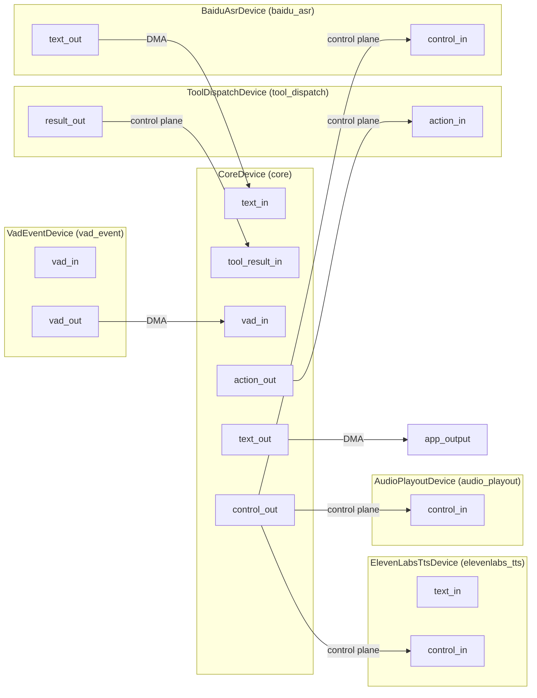

# Design Document: Core Decoupling (T2 + T3)

## Overview

This document describes the design for two coupled refactors that eliminate the last
synchronous coupling points between the agent core and the IO layer:

**T2 — Tool Call Async:** `Controller` currently holds a `std::unique_ptr<IoBridge>`
and calls `io_->Execute(ac)` synchronously inside `HandleActing`, blocking
`loop_thread_` for the full duration of every tool call. After this change, `Controller`
emits an `action/tool_call` DataFrame on `action_out`, suspends in `kActing`, and
resumes when a `kToolResult` observation arrives via the queue. A new
`ToolDispatchDevice` IoDevice handles tool execution on its own worker thread and
returns results as DataFrames.

**T3 — Control Signal Routing:** `VadEventDevice` currently holds a direct function
pointer to `asr_ptr->Flush()`, and `CoreDevice` has no `control_out` port. After this
change, all control signals flow through the device bus: `VadEventDevice` emits
`vad/event` DataFrames; `CoreDevice` converts them into `control/command` frames routed
to the appropriate IO devices; IO devices gain a `control_in` port.

Both changes enforce the existing architectural invariants:
- `AgentRuntime::DispatchFrame` never transforms frame data — it only routes.
- `CoreDevice` is the only place that translates between `DataFrame` and core types.
- `RouteTable` is the single source of truth for all data flow topology.
- All control decisions originate from `CoreDevice` (driven by `Controller`).
- `PolicyLayer` and `ContextStrategy` remain exclusively in `core/`.


## Architecture

### Current State (Before)

```
Controller ──── IoBridge::Execute() ────► ToolDispatcher ──► ToolRegistry
    │                (synchronous, blocks loop_thread_)
    │
    └── InterceptingIoBridge (in core_device.cpp)
            intercepts Execute() to emit action/tool_call DataFrame
            then delegates to real ToolDispatcher

VadEventDevice ──── on_event_ callback ────► asr_ptr->Flush()
    (direct function pointer, bypasses RouteTable)
```

### Target State (After)

```
Controller ──── EmitFrame callback ────► CoreDevice::action_out
    │                (non-blocking, loop_thread_ suspends in kActing)
    │
    └── observation_queue_ waits for kToolResult

CoreDevice:action_out ──► RouteTable ──► ToolDispatchDevice:action_in
                                              │ (worker thread)
                                              ▼
                                         ToolRegistry::Find + Execute
                                              │
ToolDispatchDevice:result_out ──► RouteTable ──► CoreDevice:tool_result_in
                                              │
                                         CoreDevice converts to kToolResult Observation
                                              │
                                         Controller resumes from kActing

VadEventDevice:vad_out ──► RouteTable ──► CoreDevice:vad_in
                                              │
                                         CoreDevice emits control/command "flush"
                                              │
CoreDevice:control_out ──► RouteTable ──► BaiduAsrDevice:control_in
                                              │
                                         BaiduAsrDevice::Flush()
```

### Data Flow Topology (StartSession routes)




## Components and Interfaces

### 1. Controller (modified)

**File:** `core/controller/controller.h/.cpp`

Remove `std::unique_ptr<IoBridge> io_` member. Replace with:

```cpp
// Injected by CoreDevice; called when Controller needs to cancel in-progress IO.
using CancelCallback = std::function<void()>;

// Injected by CoreDevice; called when Controller wants to emit a DataFrame.
using EmitFrameCallback = std::function<void(const std::string& port, io::DataFrame)>;
```

Constructor signature change:

```cpp
// Before
Controller(std::string session_id, ControllerConfig config,
           std::unique_ptr<LlmClient> llm, std::unique_ptr<IoBridge> io,
           ContextStrategy& context, PolicyLayer& policy);

// After
Controller(std::string session_id, ControllerConfig config,
           std::unique_ptr<LlmClient> llm,
           EmitFrameCallback emit_frame,
           CancelCallback cancel,
           ContextStrategy& context, PolicyLayer& policy);
```

`HandleActing` changes:
- Serializes `ActionCandidate` into an `action/tool_call` DataFrame payload
  (`tool_name:arguments` format, matching existing `InterceptingIoBridge` behavior).
- Calls `emit_frame_("action_out", frame)` — non-blocking.
- Returns immediately; `RunLoop` re-enters the `queue_cv_.wait` loop.
- When `RunLoop` dequeues a `kToolResult` observation while in `kActing`, it calls
  `HandleActingResult(obs)` which records the result, transitions to `kThinking`, and
  calls `HandleThinking(continuation)`.

`HandleInterrupt` changes:
- Replaces `io_->Cancel()` with `if (cancel_) cancel_();`.

`RunLoop` changes — new `kToolResult` branch:

```cpp
// In RunLoop, after dequeuing obs:
if (state_.load() == State::kActing &&
    obs.type == ObservationType::kToolResult) {
    HandleActingResult(obs);
    continue;
}
```

### 2. AgentSession (modified)

**File:** `core/session/session.h/.cpp`

Constructor signature mirrors Controller — removes `std::unique_ptr<IoBridge>`,
adds `EmitFrameCallback emit_frame` and `CancelCallback cancel`.

### 3. CoreDevice (modified)

**File:** `runtime/core_device.h/.cpp`

Constructor signature:

```cpp
// Before
CoreDevice(std::string device_id, std::string session_id,
           core::ControllerConfig ctrl_config, core::ContextConfig ctx_config,
           core::PolicyConfig pol_config,
           std::unique_ptr<core::LlmClient> llm,
           std::unique_ptr<core::IoBridge> io,   // REMOVED
           std::unique_ptr<core::MemoryStore> memory,
           std::unique_ptr<core::AuditSink> audit);

// After
CoreDevice(std::string device_id, std::string session_id,
           core::ControllerConfig ctrl_config, core::ContextConfig ctx_config,
           core::PolicyConfig pol_config,
           std::unique_ptr<core::LlmClient> llm,
           std::unique_ptr<core::MemoryStore> memory,
           std::unique_ptr<core::AuditSink> audit);
```

`InterceptingIoBridge` is deleted entirely.

`CoreDevice` constructs the `EmitFrameCallback` and `CancelCallback` lambdas and
passes them to `AgentSession` (and transitively to `Controller`):

```cpp
// EmitFrameCallback: called by Controller to emit action/tool_call frames
auto emit_frame = [this](const std::string& port, io::DataFrame frame) {
    EmitFrame(port, std::move(frame));
};

// CancelCallback: called by Controller on interrupt
auto cancel = [this]() {
    // Emit cancel control frame on control_out
    EmitFrame(kControlOut, ControlFrame::Make("cancel"));
};
```

New ports in `GetPortDescriptors()`:

| Port | Direction | Type |
|------|-----------|------|
| `text_in` | Input | `text/plain` |
| `tool_result_in` | Input | `action/tool_result` |
| `vad_in` | Input | `vad/event` |
| `text_out` | Output | `text/plain` |
| `action_out` | Output | `action/tool_call` |
| `control_out` | Output | `control/command` |

`OnInput` additions:
- `vad_in`: parse event name from payload; if `"speech_end"`, emit
  `ControlFrame::Make("flush")` on `control_out`.

Transition callback (registered via `Controller::OnTransition`):
- `kListening` via `kInterrupt` → emit `ControlFrame::Make("cancel")` on `control_out`.
- `kListening` via `kResponseDelivered` → emit `ControlFrame::Make("cancel")` on
  `control_out`.

### 4. ToolDispatchDevice (new)

**File:** `runtime/tool_dispatch_device.h/.cpp`

```cpp
namespace shizuru::runtime {

class ToolDispatchDevice : public io::IoDevice {
 public:
  explicit ToolDispatchDevice(services::ToolRegistry& registry,
                              std::string device_id = "tool_dispatch");
  ~ToolDispatchDevice() override;

  std::string GetDeviceId() const override;
  std::vector<io::PortDescriptor> GetPortDescriptors() const override;
  void OnInput(const std::string& port_name, io::DataFrame frame) override;
  void SetOutputCallback(io::OutputCallback cb) override;
  void Start() override;
  void Stop() override;  // drains queue, joins worker thread

 private:
  void WorkerLoop();
  void Dispatch(io::DataFrame frame);

  static constexpr char kActionIn[]  = "action_in";
  static constexpr char kResultOut[] = "result_out";

  std::string device_id_;
  services::ToolRegistry& registry_;

  io::OutputCallback output_cb_;
  mutable std::mutex output_cb_mutex_;

  std::mutex worker_mutex_;
  std::condition_variable worker_cv_;
  std::queue<io::DataFrame> task_queue_;
  std::thread worker_thread_;
  std::atomic<bool> worker_stop_{false};
};

}  // namespace shizuru::runtime
```

**Payload format** for `action/tool_call` frames: `"<tool_name>:<arguments>"` — the
same format produced by the existing `InterceptingIoBridge`. `Dispatch` splits on the
first `:` to extract `tool_name` and `arguments`.

**Payload format** for `action/tool_result` frames: JSON string
`{"success": true/false, "output": "...", "error": "..."}`. `CoreDevice::OnInput` on
`tool_result_in` passes the raw payload string as `obs.content` to the Controller,
which already handles it as an opaque string in `HandleActingResult`.

### 5. ControlFrame (new, header-only)

**File:** `io/control_frame.h`

```cpp
namespace shizuru::io {

struct ControlFrame {
  static constexpr char kCommandCancel[] = "cancel";
  static constexpr char kCommandFlush[]  = "flush";

  // Serialize a command into a DataFrame.
  static DataFrame Make(std::string_view command) {
    const std::string payload = R"({"command":")" +
                                std::string(command) + R"("})";
    DataFrame frame;
    frame.type    = "control/command";
    frame.payload = std::vector<uint8_t>(payload.begin(), payload.end());
    frame.timestamp = std::chrono::steady_clock::now();
    return frame;
  }

  // Parse a "control/command" DataFrame. Returns empty string on failure.
  static std::string Parse(const DataFrame& frame) {
    if (frame.type != "control/command") { return {}; }
    const std::string json(frame.payload.begin(), frame.payload.end());
    // Minimal parse: find "command":"<value>"
    const auto key_pos = json.find(R"("command":")");
    if (key_pos == std::string::npos) { return {}; }
    const auto val_start = key_pos + 11;  // len of "command":"
    const auto val_end   = json.find('"', val_start);
    if (val_end == std::string::npos) { return {}; }
    return json.substr(val_start, val_end - val_start);
  }
};

}  // namespace shizuru::io
```

No external JSON library dependency — the payload format is simple enough for
substring parsing. This keeps `io/control_frame.h` dependency-free.

### 6. VadEventDevice (modified)

**File:** `io/vad/vad_event_device.h/.cpp`

Remove `EventCallback on_event_` and `trigger_events_` members. Remove
`EventCallback` constructor parameter.

Add `vad_out` output port (`vad/event`). When a matching event arrives on `vad_in`,
emit a DataFrame on `vad_out` with `type = "vad/event"` and payload = event name
bytes. The `SetOutputCallback` implementation stores the callback (previously a no-op).

New constructor:

```cpp
explicit VadEventDevice(std::string device_id = "vad_event");
```

### 7. IO Devices — control_in port additions

Each device adds `control_in` to `GetPortDescriptors()` and handles it in `OnInput`:

**ElevenLabsTtsDevice:**
- `"cancel"` → `CancelSynthesis()`

**BaiduAsrDevice:**
- `"flush"` → `Flush()`
- `"cancel"` → `CancelTranscription()`

**AudioPlayoutDevice:**
- `"cancel"` → `player_->Stop()` (or equivalent immediate stop)

All devices silently ignore unrecognized commands (no log, no crash).

### 8. AgentRuntime::StartSession (modified)

Removes `ToolDispatcher` construction and the `IoBridge` argument to `CoreDevice`.
Registers `ToolDispatchDevice` and adds the new routes:

```cpp
// Tool call round-trip
route_table_.AddRoute({"core",         "action_out"},
                      {"tool_dispatch","action_in"},
                      RouteOptions{.requires_control_plane = true});
route_table_.AddRoute({"tool_dispatch","result_out"},
                      {"core",         "tool_result_in"},
                      RouteOptions{.requires_control_plane = true});

// VAD → CoreDevice
route_table_.AddRoute({"vad_event", "vad_out"},
                      {"core",      "vad_in"},
                      RouteOptions{.requires_control_plane = false});

// CoreDevice control → IO devices
route_table_.AddRoute({"core",          "control_out"},
                      {"baidu_asr",     "control_in"},
                      RouteOptions{.requires_control_plane = true});
route_table_.AddRoute({"core",          "control_out"},
                      {"elevenlabs_tts","control_in"},
                      RouteOptions{.requires_control_plane = true});
route_table_.AddRoute({"core",          "control_out"},
                      {"audio_playout", "control_in"},
                      RouteOptions{.requires_control_plane = true});
```

### 9. Files to Delete

| File | Reason |
|------|--------|
| `core/interfaces/io_bridge.h` | Interface removed; no remaining consumers |
| `services/io/tool_dispatcher.h` | Only IoBridge implementation; superseded by ToolDispatchDevice |
| `services/io/tool_dispatcher.cpp` | Same |

`ToolRegistry` (`services/io/tool_registry.h`) is retained — it is now used directly
by `ToolDispatchDevice`.


## Data Models

### action/tool_call DataFrame payload

```
<tool_name>:<arguments_json>
```

Example: `web_search:{"query":"current weather in Tokyo"}`

This format is unchanged from the existing `InterceptingIoBridge` serialization.
`ToolDispatchDevice::Dispatch` splits on the first `:` character.

### action/tool_result DataFrame payload

```json
{"success": true, "output": "<result string>"}
{"success": false, "error": "<error message>"}
```

`CoreDevice::OnInput` on `tool_result_in` passes the raw JSON string as
`obs.content`. `Controller::HandleActingResult` stores it in `ContextStrategy` as a
`MemoryEntryType::kToolResult` entry, exactly as `HandleActing` does today after
`io_->Execute()` returns.

### vad/event DataFrame payload

```
speech_end
speech_start
speech_active
```

Raw UTF-8 event name bytes. `CoreDevice::OnInput` on `vad_in` does a string
comparison against `"speech_end"` to decide whether to emit a `flush` control frame.

### control/command DataFrame payload

```json
{"command": "cancel"}
{"command": "flush"}
```

Produced by `ControlFrame::Make`, parsed by `ControlFrame::Parse`.

### Controller state machine — kActing suspension

The existing `RunLoop` wait condition:

```cpp
queue_cv_.wait(lock, [&] {
    return !observation_queue_.empty() || shutdown_requested_.load();
});
```

already handles the suspension correctly. When `HandleActing` returns after emitting
the frame (without blocking), `RunLoop` loops back to the `wait`. The loop thread
sleeps until `ToolDispatchDevice` enqueues a `kToolResult` observation via
`CoreDevice::OnInput → session_->EnqueueObservation`.

The new `kToolResult` branch in `RunLoop`:

```cpp
if (state_.load() == State::kActing &&
    obs.type == ObservationType::kToolResult) {
    HandleActingResult(obs);
    continue;
}
```

`HandleActingResult` mirrors the second half of the current `HandleActing`:

```cpp
void Controller::HandleActingResult(const Observation& obs) {
    // obs.content is the raw JSON result string from ToolDispatchDevice
    const bool success = obs.content.find(R"("success":true)") != std::string::npos;

    // Record tool result in ContextStrategy
    MemoryEntry result_entry;
    result_entry.type        = MemoryEntryType::kToolResult;
    result_entry.role        = "tool";
    result_entry.content     = obs.content;
    result_entry.tool_call_id = pending_tool_call_id_;  // stored in HandleActing
    result_entry.timestamp   = std::chrono::steady_clock::now();
    context_.RecordTurn(session_id_, result_entry);

    policy_.AuditAction(session_id_, pending_action_, success);

    TryTransition(success ? Event::kActionComplete : Event::kActionFailed);

    Observation continuation;
    continuation.type      = ObservationType::kContinuation;
    continuation.source    = "controller";
    continuation.timestamp = std::chrono::steady_clock::now();
    HandleThinking(continuation);
}
```

`pending_tool_call_id_` and `pending_action_` are new `Controller` members set in
`HandleActing` before emitting the frame, so `HandleActingResult` can reference them.


## Correctness Properties

*A property is a characteristic or behavior that should hold true across all valid
executions of a system — essentially, a formal statement about what the system should
do. Properties serve as the bridge between human-readable specifications and
machine-verifiable correctness guarantees.*

### Property 1: Tool call emit is non-blocking and produces a well-formed frame

*For any* `ActionCandidate` of type `kToolCall`, when `HandleActing` is called, the
`EmitFrameCallback` must be invoked exactly once with a DataFrame of type
`"action/tool_call"` whose payload decodes to `"<action_name>:<arguments>"`, and the
Controller must be in `kActing` state immediately after `HandleActing` returns.

**Validates: Requirements 1.2, 2.3**

### Property 2: kToolResult observation resumes the reasoning loop

*For any* tool result content string, when a `kToolResult` observation is enqueued
while the Controller is in `kActing` state, the Controller must transition to
`kThinking` (via `kActionComplete` or `kActionFailed`) and must not remain in
`kActing` indefinitely.

**Validates: Requirements 1.3, 1.4**

### Property 3: ControlFrame round-trip

*For any* command string (including `"cancel"`, `"flush"`, and arbitrary strings),
`ControlFrame::Parse(ControlFrame::Make(cmd))` must return the original command string
unchanged.

**Validates: Requirements 5.3, 5.4**

### Property 4: ToolDispatchDevice tool call round-trip

*For any* registered tool name and arguments string, when an `action/tool_call`
DataFrame with payload `"<name>:<args>"` is delivered to `ToolDispatchDevice::OnInput`,
an `action/tool_result` DataFrame must eventually be emitted on `result_out` with a
payload that reflects the tool's return value.

**Validates: Requirements 3.3**

### Property 5: Policy denial suppresses action_out emission

*For any* `ActionCandidate` of type `kToolCall` that is denied by `PolicyLayer`, no
`action/tool_call` DataFrame must be emitted on `action_out`, and the Controller must
transition to `kThinking` via `kRouteToContinue`.

**Validates: Requirements 9.2**

### Property 6: VadEventDevice pass-through emit

*For any* event name string that appears in the device's trigger list, when a
`vad/event` DataFrame containing that event name is received on `vad_in`, a `vad/event`
DataFrame must be emitted on `vad_out` with a payload equal to the event name bytes.

**Validates: Requirements 8.2**

### Property 7: speech_end on vad_in produces flush on control_out

*For any* `vad/event` DataFrame whose payload is `"speech_end"`, when delivered to
`CoreDevice::OnInput("vad_in", ...)`, a `control/command` DataFrame with command
`"flush"` must be emitted on `control_out`.

**Validates: Requirements 6.4, 8.5**

### Property 8: Interrupt produces cancel on control_out

*For any* Controller state from which `kInterrupt` is a valid transition
(`kThinking`, `kRouting`, `kActing`), when `HandleInterrupt` is called, a
`control/command` DataFrame with command `"cancel"` must be emitted on `control_out`.

**Validates: Requirements 1.5, 6.2**

### Property 9: IO devices dispatch recognized control commands

*For any* IO device that exposes `control_in` (`ElevenLabsTtsDevice`,
`BaiduAsrDevice`, `AudioPlayoutDevice`), when a `control/command` DataFrame with a
recognized command is delivered to `OnInput("control_in", ...)`, the corresponding
method (`CancelSynthesis`, `Flush`, `CancelTranscription`, or playout stop) must be
invoked exactly once.

**Validates: Requirements 7.2, 7.4, 7.5, 7.7**


## Error Handling

### ToolDispatchDevice

- **Unknown tool name:** emit `action/tool_result` with
  `{"success":false,"error":"Unknown tool: <name>"}`. Do not crash or log at error
  level — this is a normal policy-allowed but unregistered tool scenario.
- **Tool throws exception:** catch `std::exception`, emit failure result with
  `error = e.what()`. Catch `...` as a fallback, emit `"unknown exception"`. The
  worker thread must continue processing subsequent frames.
- **Stop() called with pending tasks:** drain the queue (process all pending frames)
  before joining the worker thread. This ensures in-flight tool calls complete and
  their results reach `CoreDevice` before shutdown.

### Controller — kActing state

- **Interrupt while kActing:** `HandleInterrupt` calls `cancel_()` (if non-null),
  transitions to `kListening`. Any subsequent `kToolResult` observation that arrives
  after the interrupt is discarded because `RunLoop` only processes `kToolResult` when
  `state_ == kActing`.
- **Shutdown while kActing:** `shutdown_requested_` causes `RunLoop` to exit. The
  pending tool call is abandoned. `ToolDispatchDevice::Stop()` drains its queue, but
  the result frame will be discarded by `DispatchFrame` (no route after shutdown).
- **Null CancelCallback:** `HandleInterrupt` checks `if (cancel_) cancel_();` — no-op
  if null, no crash.

### CoreDevice — vad_in

- **Unrecognized vad event:** only `"speech_end"` triggers a `flush` frame. All other
  event names are silently ignored. No log at warn level — `speech_start` and
  `speech_active` are expected and should not produce noise.

### ControlFrame parsing

- **Malformed payload:** `ControlFrame::Parse` returns an empty string. Receiving
  devices check `if (cmd.empty()) return;` before dispatching.
- **Unrecognized command:** devices silently ignore it (no log, no crash). This
  allows future commands to be added without breaking existing devices.

### IO device control_in

- All three devices (`ElevenLabsTtsDevice`, `BaiduAsrDevice`, `AudioPlayoutDevice`)
  follow the same pattern: parse command, switch on known values, default case is a
  no-op. No exception propagation out of `OnInput`.


## Testing Strategy

### Dual Testing Approach

Unit tests cover specific examples, edge cases, and integration points. Property-based
tests verify universal properties across many generated inputs. Both are required for
comprehensive coverage.

Property-based testing library: **RapidCheck** (already used in the project under
`tests/`). Each property test runs a minimum of 100 iterations.

Tag format for property tests:
`// Feature: core-decoupling, Property <N>: <property_text>`

---

### Unit Tests

**controller_test** (update existing):
- Remove all `IoBridge` mock setup.
- Example: construct `Controller` with a capturing `EmitFrameCallback`; send a
  `kToolCall` action through the LLM mock; verify the callback was called with
  `frame.type == "action/tool_call"` and `state == kActing`.
- Example: while in `kActing`, enqueue a `kToolResult` observation; verify transition
  to `kThinking`.
- Example: while in `kActing`, call `HandleInterrupt`; verify `cancel_` lambda was
  invoked and state is `kListening`.
- Edge case: construct with `cancel = nullptr`; call `HandleInterrupt` — must not
  crash.

**core_device_test** (update existing):
- Remove `InterceptingIoBridge` references.
- Example: verify `GetPortDescriptors()` contains `action_out`, `tool_result_in`,
  `vad_in`, `control_out` with correct types.
- Example: deliver `vad/event` frame with payload `"speech_end"` on `vad_in`; verify
  `control_out` emits a frame with `ControlFrame::Parse(frame) == "flush"`.
- Example: trigger `kResponseDelivered` transition; verify `control_out` emits
  `"cancel"`.

**tool_dispatch_device_test** (new):
- Example: register a tool, deliver `action/tool_call` frame, verify `result_out`
  emits a success frame.
- Edge case: deliver frame with unknown tool name; verify failure result frame.
- Edge case: register a tool that throws; verify failure result frame and device
  continues processing.
- Example: enqueue a slow task, call `Stop()`; verify `Stop()` blocks until the task
  completes and the result is emitted.

**control_frame_test** (new):
- Example: `ControlFrame::Make("cancel")` produces `frame.type == "control/command"`.
- Example: `ControlFrame::Make("flush")` produces payload containing `"flush"`.
- Edge case: `ControlFrame::Parse` on a frame with wrong type returns empty string.
- Edge case: `ControlFrame::Parse` on a malformed payload returns empty string.

**vad_event_device_test** (update existing):
- Example: deliver `vad/event` frame with `"speech_end"` payload; verify `vad_out`
  emits a frame with payload `"speech_end"`.
- Example: deliver `vad/event` frame with `"speech_start"` payload; verify no frame
  is emitted on `vad_out` (default trigger is `"speech_end"` only — but after the
  refactor, VadEventDevice emits all events; verify the payload matches).

**io_device_control_in_test** (new):
- Example: deliver `control/command "cancel"` to `ElevenLabsTtsDevice::control_in`;
  verify `CancelSynthesis()` is called (use mock `TtsClient`).
- Example: deliver `control/command "flush"` to `BaiduAsrDevice::control_in`; verify
  `Flush()` is called.
- Example: deliver `control/command "cancel"` to `BaiduAsrDevice::control_in`; verify
  `CancelTranscription()` is called.
- Edge case: deliver `control/command "unknown_cmd"` to any device; verify no crash.

---

### Property-Based Tests

**Property 1 — Tool call emit is non-blocking and produces a well-formed frame**
```
// Feature: core-decoupling, Property 1: tool call emit is non-blocking
rc::prop("for any kToolCall ActionCandidate, HandleActing emits well-formed frame", [] {
    const auto name = *rc::gen::string<std::string>();
    const auto args = *rc::gen::string<std::string>();
    // construct Controller with capturing emit callback
    // drive to kActing with ActionCandidate{kToolCall, name, args}
    // verify emitted frame type and payload
});
```

**Property 2 — kToolResult observation resumes the reasoning loop**
```
// Feature: core-decoupling, Property 2: kToolResult resumes from kActing
rc::prop("for any tool result content, kToolResult transitions out of kActing", [] {
    const auto content = *rc::gen::string<std::string>();
    // put controller in kActing
    // enqueue Observation{kToolResult, content}
    // verify state transitions to kThinking
});
```

**Property 3 — ControlFrame round-trip**
```
// Feature: core-decoupling, Property 3: ControlFrame round-trip
rc::prop("Make then Parse returns original command", [] {
    const auto cmd = *rc::gen::string<std::string>();
    RC_ASSERT(ControlFrame::Parse(ControlFrame::Make(cmd)) == cmd);
});
```

**Property 4 — ToolDispatchDevice tool call round-trip**
```
// Feature: core-decoupling, Property 4: ToolDispatchDevice round-trip
rc::prop("for any registered tool, dispatch produces a result frame", [] {
    const auto name = *rc::gen::nonEmpty(rc::gen::string<std::string>());
    const auto args = *rc::gen::string<std::string>();
    // register tool that echoes args
    // deliver action/tool_call frame
    // verify result_out emits success frame containing args
});
```

**Property 5 — Policy denial suppresses action_out emission**
```
// Feature: core-decoupling, Property 5: policy denial suppresses action_out
rc::prop("for any denied ActionCandidate, no action/tool_call frame is emitted", [] {
    const auto name = *rc::gen::string<std::string>();
    // configure PolicyLayer to deny all
    // drive Controller to kRouting with kToolCall candidate
    // verify emit callback was NOT called with action/tool_call
    // verify state is kThinking
});
```

**Property 6 — VadEventDevice pass-through emit**
```
// Feature: core-decoupling, Property 6: VadEventDevice pass-through emit
rc::prop("for any event name, vad_in frame is re-emitted on vad_out", [] {
    const auto event = *rc::gen::nonEmpty(rc::gen::string<std::string>());
    // construct VadEventDevice
    // deliver vad/event frame with payload = event
    // verify vad_out emits frame with same payload
});
```

**Property 7 — speech_end on vad_in produces flush on control_out**
```
// Feature: core-decoupling, Property 7: speech_end produces flush
rc::prop("any speech_end vad frame produces flush control frame", [] {
    // construct CoreDevice with capturing output callback
    // deliver vad/event frame with payload "speech_end"
    // verify control_out emits frame with Parse == "flush"
});
```

**Property 8 — Interrupt produces cancel on control_out**
```
// Feature: core-decoupling, Property 8: interrupt produces cancel
rc::prop("interrupt from any interruptible state emits cancel on control_out", [] {
    const auto state = *rc::gen::element(
        State::kThinking, State::kRouting, State::kActing);
    // put controller in that state
    // trigger interrupt
    // verify control_out emits frame with Parse == "cancel"
});
```

**Property 9 — IO devices dispatch recognized control commands**
```
// Feature: core-decoupling, Property 9: IO devices dispatch control commands
rc::prop("for any recognized command, the corresponding method is invoked", [] {
    // generate (device_type, command) pairs from the recognized set
    // deliver control frame
    // verify the method was called exactly once
});
```

