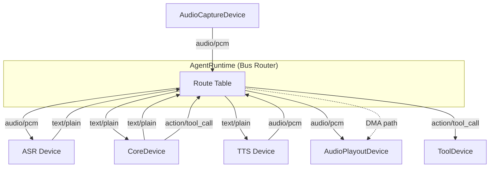
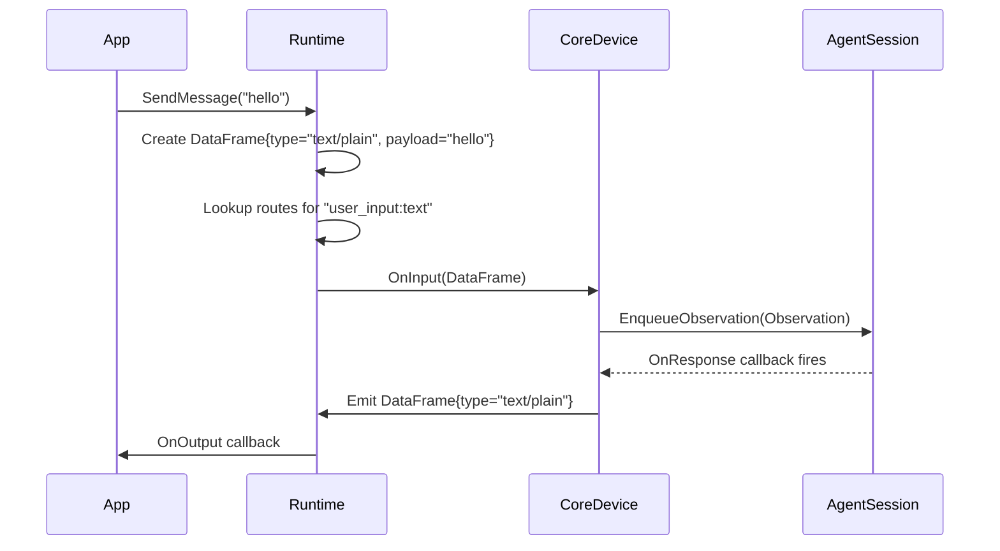
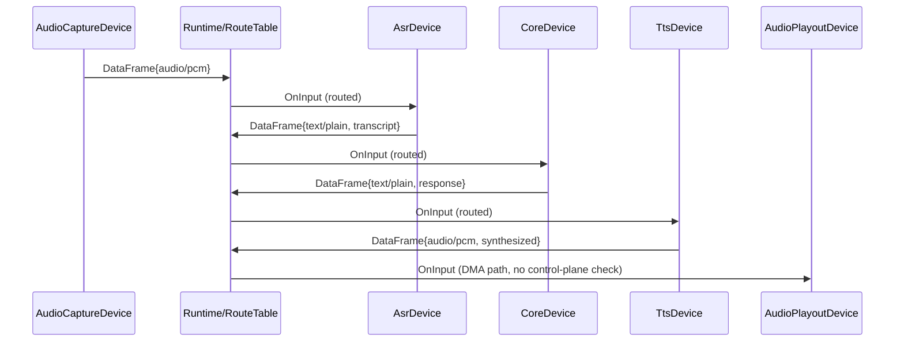

# Design Document: Runtime IO Redesign

## Overview

The current `AgentRuntime` (~380 lines) is a god class that hardcodes VAD gating, STT transcription, TTS synthesis, and audio routing logic directly into the runtime. This design replaces it with a "motherboard" / bus router architecture where:

- All IO capabilities (TTS, ASR, audio capture/playback, tool dispatch) become **IO devices** with a uniform interface.
- The runtime maintains a **route table** that declaratively maps data flows between devices.
- **DMA paths** allow high-frequency audio data to bypass the agent core entirely.
- A **CoreDevice** adapter wraps the existing `AgentSession` so it participates in the IO device system without any modifications to `core/`.

The key invariant: the runtime performs **zero data transformation**. It is purely a lifecycle manager and data router. All transformation logic lives inside IO devices.



### What changes

| Component | Before | After |
|-----------|--------|-------|
| `runtime/agent_runtime.h/.cpp` | God class with hardcoded VAD/STT/TTS | Bus router with route table |
| TTS integration | Tool function lookup in runtime | `TtsDevice` IO device under `io/tts/` |
| ASR integration | Tool function lookup in runtime | `AsrDevice` IO device under `io/asr/` |
| Audio routing | Not managed by runtime | Route table entries, DMA paths |
| Core interaction | Direct `AgentSession` calls | `CoreDevice` adapter implementing `IoDevice` |

### What does NOT change

- Everything under `core/` (Controller, AgentSession, IoBridge, ContextStrategy, PolicyLayer)
- `services/io/tool_dispatcher.h/.cpp` and `services/io/tool_registry.h`
- `io/audio/` directory (AudioPlayer, AudioRecorder, AudioDevice, AudioFrame, AudioBuffer)
- Existing vendor client implementations (`ElevenLabsClient`, `BaiduAsrClient`)

## Architecture

The architecture follows the OS-inspired model from AGENTS.md, with the runtime acting as a hardware bus that connects IO devices to each other and to the agent core.

### Layered View

```
┌─────────────────────────────────────────────────────┐
│  Application Layer (examples, Flutter UI via FFI)   │
├─────────────────────────────────────────────────────┤
│  Runtime Layer (bus router + route table)            │
│    AgentRuntime  ──  RouteTable                     │
├─────────────────────────────────────────────────────┤
│  IO Device Layer (uniform IoDevice interface)        │
│    CoreDevice │ TtsDevice │ AsrDevice │ AudioDevices│
├─────────────────────────────────────────────────────┤
│  Service Layer (vendor implementations)              │
│    ElevenLabsClient │ BaiduAsrClient │ ...          │
├─────────────────────────────────────────────────────┤
│  Core Layer (UNCHANGED)                              │
│    Controller │ AgentSession │ IoBridge │ Policy    │
└─────────────────────────────────────────────────────┘
```

### Data Flow: Text Conversation



### Data Flow: Voice Conversation with DMA



### Control Plane vs Data Plane

- **Control plane**: Route activation/deactivation, device lifecycle, state queries. Low frequency.
- **Data plane**: DataFrame delivery along routes. High frequency for audio (~50 frames/sec at 20ms).
- DMA routes skip control-plane evaluation entirely, delivering frames with minimal overhead (single callback invocation).

## Components and Interfaces

### Directory Structure

```
io/
  ├── io_device.h           ← IoDevice base interface + OutputCallback
  ├── data_frame.h          ← DataFrame struct
  ├── audio/                ← existing, unchanged
  ├── tts/
  │   ├── tts_device.h      ← TtsDevice interface (extends IoDevice)
  │   └── types.h           ← TtsRequest/TtsResult types
  └── asr/
      ├── asr_device.h      ← AsrDevice interface (extends IoDevice)
      └── types.h           ← AsrRequest/AsrResult types

runtime/
  ├── agent_runtime.h/.cpp  ← rewritten as bus router
  ├── route_table.h         ← RouteTable + Route structs
  └── core_device.h/.cpp    ← CoreDevice adapter

services/
  ├── tts/elevenlabs/
  │   └── elevenlabs_tts_device.h/.cpp  ← ElevenLabs TtsDevice impl
  ├── asr/baidu/
  │   └── baidu_asr_device.h/.cpp       ← Baidu AsrDevice impl
  └── ...                               ← existing services unchanged
```

### IoDevice Interface (`io/io_device.h`)

```cpp
namespace shizuru::io {

// Port direction.
enum class PortDirection { kInput, kOutput };

// Descriptor for a named port on an IO device.
struct PortDescriptor {
  std::string name;           // e.g., "audio_in", "text_out"
  PortDirection direction;
  std::string data_type;      // MIME-like: "audio/pcm", "text/plain", etc.
};

// Callback type for outgoing data frames.
// device_id: the emitting device's ID
// port_name: the output port name
// frame: the data being emitted
using OutputCallback = std::function<void(
    const std::string& device_id,
    const std::string& port_name,
    DataFrame frame)>;

// Base interface for all IO devices in the system.
class IoDevice {
 public:
  virtual ~IoDevice() = default;

  // Unique identifier for this device instance.
  virtual std::string GetDeviceId() const = 0;

  // Ports this device exposes.
  virtual std::vector<PortDescriptor> GetPortDescriptors() const = 0;

  // Accept an incoming data frame on a named input port.
  virtual void OnInput(const std::string& port_name, DataFrame frame) = 0;

  // Register the callback the device uses to emit output frames.
  virtual void SetOutputCallback(OutputCallback cb) = 0;

  // Lifecycle.
  virtual void Start() = 0;
  virtual void Stop() = 0;
};

}  // namespace shizuru::io
```

Design decisions:
- `OnInput` takes a port name so a single device can have multiple input ports (e.g., CoreDevice accepts both `text_in` and `tool_result_in`).
- `SetOutputCallback` is called once by the runtime during device registration. The device calls this callback whenever it has output.
- `Start()`/`Stop()` manage the device's internal resources (threads, connections, etc.).
- A stopped device silently discards frames received via `OnInput`.

### DataFrame (`io/data_frame.h`)

```cpp
namespace shizuru::io {

struct DataFrame {
  std::string type;       // MIME-like: "audio/pcm", "text/plain",
                          //            "text/json", "action/tool_call"
  std::vector<uint8_t> payload;  // Raw data bytes

  std::string source_device;     // Originating device ID
  std::string source_port;       // Originating port name

  std::chrono::steady_clock::time_point timestamp;

  // Optional key-value metadata.
  // Examples: {"sample_rate": "16000"}, {"language": "en"}, {"tool_name": "web_search"}
  std::unordered_map<std::string, std::string> metadata;
};

}  // namespace shizuru::io
```

Design decisions:
- `payload` is `std::vector<uint8_t>` rather than `std::string` to clearly signal binary data semantics. For text payloads, UTF-8 bytes are stored directly.
- `metadata` is a flat string map. This avoids pulling in a JSON library dependency at the IO layer. Devices that need structured metadata can serialize/deserialize within their own implementation.
- `timestamp` uses `steady_clock` consistent with the rest of the codebase (`Observation::timestamp`).

### RouteTable (`runtime/route_table.h`)

```cpp
namespace shizuru::runtime {

// Fully qualified port address: "device_id:port_name"
struct PortAddress {
  std::string device_id;
  std::string port_name;

  bool operator==(const PortAddress& o) const {
    return device_id == o.device_id && port_name == o.port_name;
  }
};

struct PortAddressHash {
  std::size_t operator()(const PortAddress& a) const {
    auto h1 = std::hash<std::string>{}(a.device_id);
    auto h2 = std::hash<std::string>{}(a.port_name);
    return h1 ^ (h2 << 16);
  }
};

struct RouteOptions {
  bool requires_control_plane = true;  // false = DMA path
};

struct Route {
  PortAddress source;
  PortAddress destination;
  RouteOptions options;
};

class RouteTable {
 public:
  void AddRoute(PortAddress source, PortAddress destination,
                RouteOptions options = {});
  void RemoveRoute(const PortAddress& source, const PortAddress& destination);

  // Returns all destinations for a given source port.
  std::vector<std::pair<PortAddress, RouteOptions>>
  Lookup(const PortAddress& source) const;

  // Returns all routes in the table.
  std::vector<Route> AllRoutes() const;

  bool IsEmpty() const;

 private:
  // Map from source port → list of (destination, options).
  std::unordered_map<PortAddress,
                     std::vector<std::pair<PortAddress, RouteOptions>>,
                     PortAddressHash> routes_;
};

}  // namespace shizuru::runtime
```

Design decisions:
- The route table is a simple multimap from source port to destination ports. Fan-out (one source → multiple destinations) is supported natively.
- `requires_control_plane` flag distinguishes DMA paths from gated routes. The runtime checks this flag before delivering each frame.
- Thread safety: the route table is modified only during setup/teardown (single-threaded). During data flow, it is read-only. If dynamic route changes are needed later, a read-write lock can be added.

### CoreDevice (`runtime/core_device.h`)

```cpp
namespace shizuru::runtime {

// Adapter that wraps AgentSession to participate in the IoDevice system.
// Translates between DataFrame and core types (Observation, ActionCandidate).
class CoreDevice : public io::IoDevice {
 public:
  // Takes ownership of the session dependencies, constructs AgentSession internally.
  CoreDevice(const std::string& device_id,
             const std::string& session_id,
             core::ControllerConfig ctrl_config,
             core::ContextConfig ctx_config,
             core::PolicyConfig pol_config,
             std::unique_ptr<core::LlmClient> llm,
             std::unique_ptr<core::IoBridge> io,
             std::unique_ptr<core::MemoryStore> memory,
             std::unique_ptr<core::AuditSink> audit);

  // IoDevice interface
  std::string GetDeviceId() const override;
  std::vector<io::PortDescriptor> GetPortDescriptors() const override;
  void OnInput(const std::string& port_name, io::DataFrame frame) override;
  void SetOutputCallback(io::OutputCallback cb) override;
  void Start() override;
  void Stop() override;

  // Direct access for backward-compatible API (GetState, etc.)
  core::AgentSession& Session();
  core::State GetState() const;

 private:
  std::string device_id_;
  std::unique_ptr<core::AgentSession> session_;
  io::OutputCallback output_cb_;

  // Port names
  static constexpr char kTextIn[] = "text_in";
  static constexpr char kToolResultIn[] = "tool_result_in";
  static constexpr char kTextOut[] = "text_out";
  static constexpr char kActionOut[] = "action_out";
};

}  // namespace shizuru::runtime
```

Design decisions:
- CoreDevice owns the `AgentSession` and constructs it internally. This keeps the session lifecycle tied to the device lifecycle.
- Input ports: `text_in` (user messages → Observation), `tool_result_in` (tool results → Observation).
- Output ports: `text_out` (assistant responses), `action_out` (tool call requests).
- The existing `ToolDispatcher` is passed as the `IoBridge` to `AgentSession`, completely unchanged.
- CoreDevice hooks into `Controller::OnResponse` to capture assistant responses and emit them as DataFrames.

### TtsDevice Interface (`io/tts/tts_device.h`)

```cpp
namespace shizuru::io {

// Vendor-agnostic TTS device interface.
// Accepts text DataFrames, emits audio DataFrames.
class TtsDevice : public IoDevice {
 public:
  // Input port: "text_in" (accepts "text/plain" DataFrames)
  // Output port: "audio_out" (emits "audio/pcm" DataFrames)

  // Cancels in-progress synthesis (delegates to Stop()).
  virtual void CancelSynthesis() = 0;
};

}  // namespace shizuru::io
```

### AsrDevice Interface (`io/asr/asr_device.h`)

```cpp
namespace shizuru::io {

// Vendor-agnostic ASR device interface.
// Accepts audio DataFrames, emits text DataFrames.
class AsrDevice : public IoDevice {
 public:
  // Input port: "audio_in" (accepts "audio/pcm" DataFrames)
  // Output port: "text_out" (emits "text/plain" DataFrames)

  // Cancels in-progress transcription (delegates to Stop()).
  virtual void CancelTranscription() = 0;
};

}  // namespace shizuru::io
```

### AgentRuntime (Rewritten as Bus Router)

```cpp
namespace shizuru::runtime {

class AgentRuntime {
 public:
  using OutputCallback = std::function<void(const RuntimeOutput& output)>;

  AgentRuntime(RuntimeConfig config, services::ToolRegistry& tools);
  ~AgentRuntime();

  // Device management
  void RegisterDevice(std::unique_ptr<io::IoDevice> device);
  void UnregisterDevice(const std::string& device_id);

  // Route management
  void AddRoute(PortAddress source, PortAddress destination,
                RouteOptions options = {});
  void RemoveRoute(const PortAddress& source, const PortAddress& destination);

  // Backward-compatible public API
  std::string StartSession();
  void SendMessage(const std::string& content);
  void OnOutput(OutputCallback cb);
  void Shutdown();
  core::State GetState() const;

 private:
  void DispatchFrame(const std::string& device_id,
                     const std::string& port_name,
                     io::DataFrame frame);

  RuntimeConfig config_;
  services::ToolRegistry& tools_;

  RouteTable route_table_;
  std::unordered_map<std::string, std::unique_ptr<io::IoDevice>> devices_;
  std::vector<std::string> registration_order_;  // for ordered shutdown

  CoreDevice* core_device_ = nullptr;  // non-owning, points into devices_

  mutable std::mutex output_cb_mutex_;
  OutputCallback output_cb_;
};

}  // namespace shizuru::runtime
```

Design decisions:
- `RegisterDevice` takes ownership via `unique_ptr`. The runtime stores devices in a map keyed by device ID.
- `registration_order_` tracks insertion order so `Shutdown()` can stop devices in reverse order.
- `core_device_` is a non-owning pointer for quick access to the CoreDevice (needed by `GetState()`, `SendMessage()`).
- `DispatchFrame` is the central routing function: looks up the route table, checks control-plane flags, and delivers frames to destination devices.
- The backward-compatible API (`StartSession`, `SendMessage`, `OnOutput`, `Shutdown`, `GetState`) is preserved. `StartSession` internally creates all devices, wires routes, and starts them. `SendMessage` creates a DataFrame and injects it into the routing system.

## Data Models

### DataFrame Type Tags

| Type Tag | Payload Format | Usage |
|----------|---------------|-------|
| `audio/pcm` | Raw s16le PCM bytes | Audio capture → ASR, TTS → playout |
| `text/plain` | UTF-8 string bytes | User text, ASR transcript, assistant response |
| `text/json` | UTF-8 JSON bytes | Structured data between devices |
| `action/tool_call` | JSON `{name, arguments}` | CoreDevice → ToolDevice |
| `action/tool_result` | JSON `{success, output}` | ToolDevice → CoreDevice |

### Port Naming Convention

Devices follow a consistent port naming scheme:

| Device | Input Ports | Output Ports |
|--------|------------|--------------|
| CoreDevice | `text_in`, `tool_result_in` | `text_out`, `action_out` |
| TtsDevice | `text_in` | `audio_out` |
| AsrDevice | `audio_in` | `text_out` |
| AudioCaptureDevice | (none — produces only) | `audio_out` |
| AudioPlayoutDevice | `audio_in` | (none — consumes only) |

### Route Table: Text-Only Session

```
core_device:text_out  →  [app_output_sink]   (control-plane gated)
```

`SendMessage()` directly injects a DataFrame into `core_device:text_in`.

### Route Table: Voice Session

```
mic:audio_out         →  asr:audio_in         (control-plane gated)
asr:text_out          →  core_device:text_in   (control-plane gated)
core_device:text_out  →  tts:text_in           (control-plane gated)
core_device:text_out  →  [app_output_sink]     (control-plane gated)
tts:audio_out         →  speaker:audio_in      (DMA path)
core_device:action_out→  tool_device:action_in (control-plane gated)
tool_device:result_out→  core_device:tool_result_in (control-plane gated)
```

The TTS→speaker route is a DMA path: audio frames flow directly without control-plane evaluation, achieving minimal latency.

### Mapping to Existing Core Types

| DataFrame | Core Type | Direction |
|-----------|-----------|-----------|
| `{type: "text/plain", payload: "hello"}` | `Observation{type: kUserMessage, content: "hello"}` | Into CoreDevice |
| `{type: "action/tool_result", payload: "{...}"}` | `Observation{type: kToolResult, content: "..."}` | Into CoreDevice |
| `{type: "text/plain", payload: "response"}` | `ActionCandidate{type: kResponse, response_text: "response"}` | Out of CoreDevice |
| `{type: "action/tool_call", payload: "{name, args}"}` | `ActionCandidate{type: kToolCall, action_name, arguments}` | Out of CoreDevice |


## Correctness Properties

*A property is a characteristic or behavior that should hold true across all valid executions of a system — essentially, a formal statement about what the system should do. Properties serve as the bridge between human-readable specifications and machine-verifiable correctness guarantees.*

### Property 1: Device ID Uniqueness

*For any* set of IO devices registered in the runtime, all values returned by `GetDeviceId()` shall be distinct.

**Validates: Requirements 1.4**

### Property 2: Device Lifecycle Controls Frame Processing

*For any* IO device and *for any* DataFrame, after `Start()` is called the device shall process input frames (not discard them), and after `Stop()` is called the device shall silently discard all input frames without error.

**Validates: Requirements 1.6, 1.7, 1.8**

### Property 3: Route Table Add/Remove Round Trip

*For any* source `PortAddress` and destination `PortAddress`, after calling `AddRoute(source, destination)`, `Lookup(source)` shall include that destination. After calling `RemoveRoute(source, destination)`, `Lookup(source)` shall no longer include that destination.

**Validates: Requirements 3.2, 3.3**

### Property 4: Fan-Out Delivery

*For any* route table configuration with N destinations for a given source port, and *for any* DataFrame emitted on that source port, all N destination devices shall receive the frame via `OnInput`.

**Validates: Requirements 3.4**

### Property 5: Control-Plane Gating vs DMA Bypass

*For any* route, if `requires_control_plane` is false (DMA path), the DataFrame shall always be delivered to the destination regardless of control-plane state. If `requires_control_plane` is true, the DataFrame shall only be delivered when the control-plane condition evaluates to true.

**Validates: Requirements 3.7, 3.8, 4.1**

### Property 6: CoreDevice Text-to-Observation Translation

*For any* DataFrame with `type="text/plain"` delivered to CoreDevice's `text_in` port, the CoreDevice shall enqueue an `Observation` on the wrapped `AgentSession` where `Observation.content` equals the UTF-8 decoded payload and `Observation.type` equals `kUserMessage`.

**Validates: Requirements 5.2**

### Property 7: CoreDevice ActionCandidate-to-DataFrame Translation

*For any* `ActionCandidate` emitted by the Controller, the CoreDevice shall emit a DataFrame where: if `ActionCandidate.type == kResponse`, the DataFrame has `type="text/plain"` and payload equals `response_text`; if `ActionCandidate.type == kToolCall`, the DataFrame has `type="action/tool_call"` and payload contains the serialized `action_name` and `arguments`.

**Validates: Requirements 5.3**

### Property 8: CoreDevice Unsupported Type Discard

*For any* DataFrame with a `type` not in the set `{"text/plain", "action/tool_result"}`, when delivered to CoreDevice via `OnInput`, the CoreDevice shall not emit any output DataFrame and shall not throw.

**Validates: Requirements 5.6**

### Property 9: TTS Device Text-to-Audio Transformation

*For any* non-empty text DataFrame delivered to a TTS device's `text_in` port, the device shall emit one or more DataFrames on its `audio_out` port with `type="audio/pcm"`.

**Validates: Requirements 6.2**

### Property 10: ASR Device Audio-to-Text Transformation

*For any* audio DataFrame delivered to an ASR device's `audio_in` port, the device shall emit a DataFrame on its `text_out` port with `type="text/plain"`.

**Validates: Requirements 7.2**

### Property 11: Zero Transformation Invariant

*For any* DataFrame emitted by a source device and delivered to a destination device through the runtime's routing, the delivered DataFrame shall be byte-identical to the emitted DataFrame (same `type`, `payload`, `source_device`, `source_port`, `timestamp`, and `metadata`).

**Validates: Requirements 8.1**

### Property 12: Reverse-Order Shutdown

*For any* sequence of N devices registered in order [D1, D2, ..., DN], when `Shutdown()` is called, `Stop()` shall be invoked on each device in reverse order [DN, DN-1, ..., D1].

**Validates: Requirements 8.6**

### Property 13: SendMessage Routes to CoreDevice

*For any* string `content`, when `SendMessage(content)` is called on the runtime, the CoreDevice shall receive a DataFrame with `type="text/plain"` and payload equal to the UTF-8 bytes of `content`.

**Validates: Requirements 11.6**

## Error Handling

### Device-Level Errors

| Scenario | Handling |
|----------|----------|
| `OnInput` called on stopped device | Silently discard the frame. No exception, no log spam. |
| `OnInput` with unsupported type | Log warning, discard frame. Device-specific (e.g., CoreDevice logs and drops unknown types). |
| Device `Start()` fails | Throw `std::runtime_error`. Runtime catches during `StartSession()` and propagates to caller. |
| Device `Stop()` fails | Log error, continue stopping remaining devices. Do not propagate exceptions during shutdown. |
| TTS synthesis fails | TtsDevice logs error, does not emit output frame. Upstream devices are unaffected. |
| ASR transcription fails | AsrDevice logs error, does not emit output frame. Audio continues flowing on other routes. |

### Routing-Level Errors

| Scenario | Handling |
|----------|----------|
| Frame emitted on port with no routes | Silently discarded. This is normal (not all ports are always routed). |
| Destination device not found in registry | Log warning, skip that route entry. Other destinations still receive the frame. |
| Destination `OnInput` throws | Runtime catches exception, logs error, continues delivering to remaining destinations. One failing device does not block others. |
| Duplicate route added | `AddRoute` is idempotent — adding the same source→destination pair again is a no-op. |
| Remove non-existent route | `RemoveRoute` is a no-op if the route doesn't exist. |

### Lifecycle Errors

| Scenario | Handling |
|----------|----------|
| `SendMessage` before `StartSession` | No-op (no CoreDevice exists). Consistent with current behavior. |
| `StartSession` called twice | First session is shut down before starting the new one. Same as current behavior. |
| `Shutdown` called twice | Second call is a no-op (devices already stopped and cleared). |
| Device registration with duplicate ID | `RegisterDevice` rejects with `std::invalid_argument`. Device IDs must be unique. |

## Testing Strategy

### Property-Based Testing

Property-based testing library: [rapidcheck](https://github.com/emil-e/rapidcheck) (C++ QuickCheck-style library, compatible with Google Test).

Each correctness property from the design maps to exactly one property-based test. Tests run a minimum of 100 iterations with randomly generated inputs.

Each test is tagged with a comment referencing the design property:
```cpp
// Feature: runtime-io-redesign, Property 3: Route Table Add/Remove Round Trip
RC_GTEST_PROP(RouteTableTest, AddRemoveRoundTrip, ()) {
  // ...
}
```

Property tests focus on:
- **RouteTable**: Properties 3, 4, 5 (add/remove round trip, fan-out delivery, DMA vs gated)
- **DataFrame routing**: Property 11 (zero transformation invariant)
- **CoreDevice translation**: Properties 6, 7, 8 (text↔Observation, ActionCandidate↔DataFrame, unsupported type)
- **Runtime lifecycle**: Properties 2, 12 (device lifecycle, reverse shutdown order)
- **Public API**: Property 13 (SendMessage routing)

### Unit Testing

Unit tests complement property tests by covering specific examples, integration points, and edge cases:

- **RouteTable unit tests**: Empty table lookup returns nothing, single route works, fan-out with 3 destinations, remove middle route.
- **CoreDevice unit tests**: Specific text message → Observation mapping, specific tool call ActionCandidate → DataFrame mapping, unsupported "video/mp4" type is discarded.
- **AgentRuntime integration tests**: `StartSession` → `SendMessage` → verify output callback fires. `Shutdown` stops all devices. `GetState` returns correct controller state.
- **TtsDevice mock tests**: Verify ElevenLabs adapter correctly wraps `ElevenLabsClient::Synthesize` and emits audio DataFrames.
- **AsrDevice mock tests**: Verify Baidu adapter correctly wraps `BaiduAsrClient::Transcribe` and emits text DataFrames.

### Test File Organization

```
tests/
  runtime/
    route_table_test.cpp          ← unit tests for RouteTable
    route_table_prop_test.cpp     ← property tests for RouteTable (Properties 3, 4, 5)
    core_device_test.cpp          ← unit tests for CoreDevice
    core_device_prop_test.cpp     ← property tests for CoreDevice (Properties 6, 7, 8)
    agent_runtime_test.cpp        ← unit + integration tests for AgentRuntime
    agent_runtime_prop_test.cpp   ← property tests for AgentRuntime (Properties 2, 11, 12, 13)
  services/
    elevenlabs_tts_device_test.cpp
    baidu_asr_device_test.cpp
```

### Mock Strategy

- **MockIoDevice**: Implements `IoDevice` with recording of all `OnInput` calls, configurable output emission, and Start/Stop state tracking. Used for routing and lifecycle tests.
- **MockAgentSession**: Not needed — CoreDevice tests use the real `AgentSession` with mock `LlmClient`, `IoBridge`, `MemoryStore`, and `AuditSink` (existing mocks in `tests/agent/mocks/`).
- **MockTtsClient / MockAsrClient**: Wrap the vendor client interfaces to return canned responses for device adapter tests.

