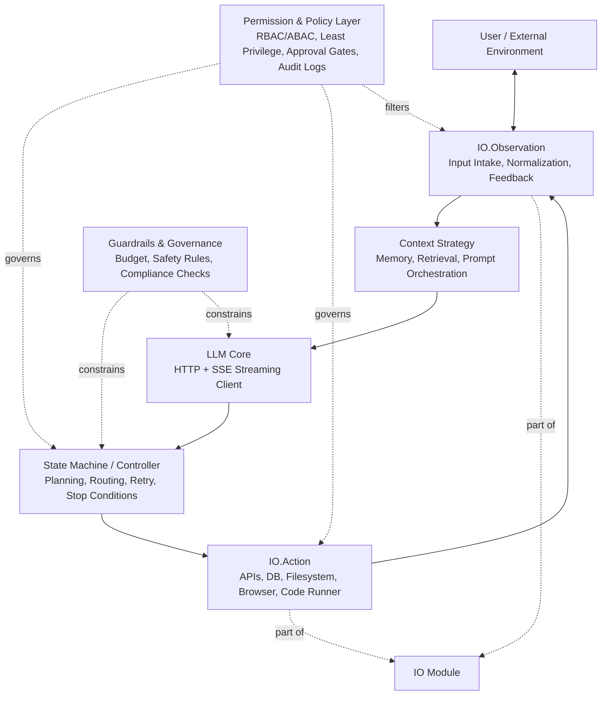
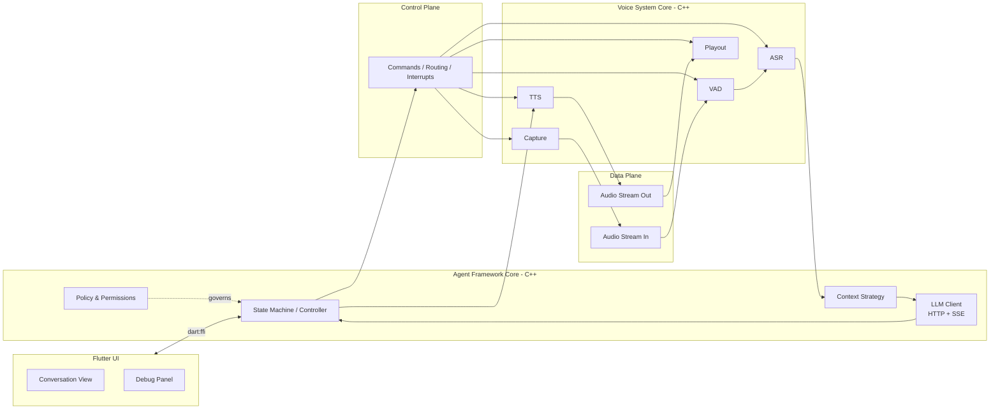

All the markdown documents should be written in English.

## Technology Stack

- Core runtime (agent framework + audio): C++17
- UI layer: Flutter (Dart), communicates with C++ core via dart:ffi
- LLM integration: OpenAI compatible API (HTTP + SSE streaming)
- Build system: CMake (C++ core), Flutter toolchain (UI)
- All AI model calls use API-based invocation, no local model inference

## Cross-Platform Strategy

The C++ core is the single shared codebase across all platforms.
Platform-specific code is isolated behind abstract interfaces (e.g., audio backends).

| Platform        | Audio Backend     | UI            | Agent Core |
|-----------------|-------------------|---------------|------------|
| macOS / Linux   | PortAudio         | Flutter       | C++        |
| Windows         | PortAudio / WASAPI| Flutter       | C++        |
| Android         | Oboe              | Flutter       | C++        |
| iOS             | CoreAudio         | Flutter       | C++        |

```
┌─────────────────────────────────────────┐
│              UI Layer (Flutter)          │
│  Dart: conversation UI, debug panel     │
└──────────────┬──────────────────────────┘
               │ dart:ffi
┌──────────────▼──────────────────────────┐
│         C++ Core (all platforms)        │
│  core/    controller, context, policy   │
│  llm/     OpenAI compatible client      │
│  io/      audio, observation, action    │
│  runtime/ control plane, data plane     │
└─────────────────────────────────────────┘
```

## Agent Architecture (OS-Inspired)

This architecture models an agent system similarly to an operating system:
- LLM as the reasoning core (CPU-like component)
- State machine as control flow and lifecycle manager
- IO module as the external interaction boundary
  - IO.Action for tool execution and side-effect operations
  - IO.Observation for input intake and result normalization
- Context strategy as memory and prompt orchestration
- Permission and policy layer as built-in security boundary



### Runtime Loop

1. Receive new user or environment input through IO.Observation.
2. Normalize and inject relevant data into context.
3. Let the LLM generate the next action candidate (via OpenAI compatible API).
4. Let the controller decide route: answer directly, call IO.Action, or continue planning.
5. Execute IO actions under permission and policy checks.
6. Feed execution results back through IO.Observation.
7. Repeat until stop condition is met, then return final response.

## Voice Conversation Architecture (Decoupled Design)

The project is built around two independent but coordinated cores:
- Voice System Core: `capture`, `vad`, `asr`, `tts`, `playout` (C++, platform-specific backends)
- Agent Framework Core: reasoning, control, context, policy, and IO orchestration (C++, platform-independent)

Design principle:
- The voice pipeline is not hard-wired into the agent logic.
- For the agent, voice capabilities are IO devices/services.
- Whether `capture` data should enter `vad` is a controller decision, not a fixed pipeline rule.
- When the agent wants to provide voice feedback, it invokes `tts` through IO.Action.

To preserve low latency, split runtime communication into:
- Control Plane: low-frequency decisions and commands (start, stop, route, interrupt)
- Data Plane: high-frequency audio flow (can bypass LLM/controller loops, DMA-like direct path)



### Practical Boundary Rules

1. Decision ownership stays in the controller.
2. Voice runtime owns real-time media processing and quality.
3. Agent runtime owns orchestration, permissions, auditing, and task policies.
4. Data plane should avoid token-by-token LLM involvement for streaming media.
5. Flutter UI communicates with C++ core via dart:ffi; no business logic in Dart.

### Audio Backend Strategy

Audio recorder and player are defined as abstract C++ interfaces.
Platform-specific implementations live in separate directories:

```
io/audio/audio_device/
├── audio_recorder.h          # abstract interface
├── audio_player.h            # abstract interface
├── audio_device.h            # facade (concrete, owns recorder + player)
├── sample_format.h           # SampleFormat enum (kInt16, kFloat32)
├── audio_buffer.h            # lock-free ring buffer (template, internal)
├── port_audio/               # desktop: macOS, Linux, Windows
├── oboe/                     # Android
└── core_audio/               # iOS
```

CMake selects the correct backend at build time based on target platform.
